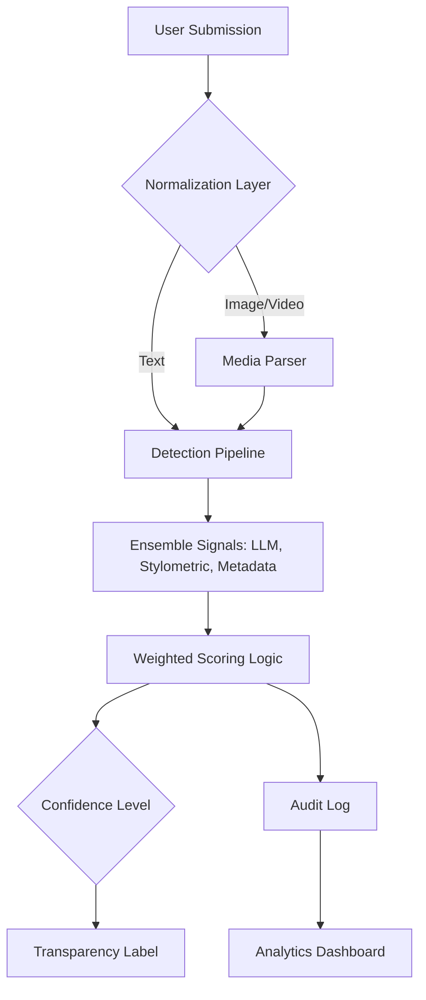

# planning.md

## Architecture

**Narrative:** The system ingests content and normalizes it into text. This text is
evaluated by three independent signals, which are aggregated via weighted voting to
determine a confidence score. All decisions are logged for audit and analytics.

## Detection Signals
- **Signal 1 (LLM):** Uses Groq Llama-3.3-70b to evaluate semantic coherence.
  *Blind spot:* May struggle with highly abstract poetry.
- **Signal 2 (Stylometrics):** Measures type-token ratio and sentence variance in pure
  Python. *Blind spot:* Can be fooled by deliberate, formulaic human writing.
- **Signal 3 (Metadata):** Inspects EXIF/structure for AI-generator watermarks.
  *Blind spot:* Easily stripped by platform uploads.

## Uncertainty Representation
- `0.00 - 0.40`: Likely Human.
- `0.41 - 0.69`: Uncertain (requires creator manual review).
- `0.70 - 1.00`: Likely AI-Generated.

## Transparency Label Variants
- **High-Confidence AI:** "This content shows strong indicators of being AI-generated."
- **Uncertain:** "Attribution inconclusive. Contextual verification recommended."
- **High-Confidence Human:** "This content displays human-typical stylistic variation."

## Appeals Workflow
1. Creators submit `content_id` and `reasoning`.
2. System updates status to `under_review` and creates a new log entry.

## AI Tool Plan
- **M3:** Generate Flask skeleton and Signal 1 (LLM) function.
- **M4:** Generate Signal 2/3 (Stylometric/Metadata) and weighted scoring function.
- **M5:** Generate `label_generator` and `/appeal` endpoint.
