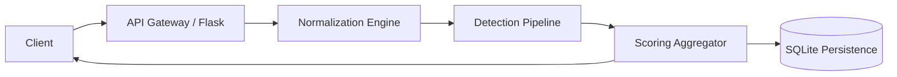

# System Design: Provenance Guard

## 1. High-Level Architecture
The system follows a synchronous request-response pattern for small payloads and a
queued-processing logic for multi-modal uploads.

## 2. Component Definitions
- **API Gateway (Flask):** Serves as the interface. Handles authentication (via API
  key), rate limiting, and request validation.
- **Normalization Engine:** A middleware layer that abstracts input complexity. It
  transforms binary data (images/videos) into semantic text using VLM and ASR (Whisper).
- **Detection Pipeline:** A pluggable architecture running three concurrent signal
  functions.
- **Scoring Aggregator:** Implements a weighted voting algorithm
  ($S = w_1 s_1 + w_2 s_2 + w_3 s_3$) to ensure transparency labels are based on
  ensemble consensus rather than a single point of failure.
- **Persistence Layer (SQLite):** Stores audit logs, content status, and user-verified
  certificates.

## 3. Data Flow
- **Submission Flow:** `POST /submit` -> Normalization -> Signal Processing -> Scoring
  -> Audit Log -> Response.
- **Appeals Flow:** `POST /appeal` -> Fetch original log -> Update status to
  `under_review` -> Log event -> Notify Queue.

## 4. API Contract
- `POST /submit`: Accepts `{"text": "...", "creator_id": "...", "file": "..."}`.
  Returns `content_id`, `attribution`, `confidence`, `label`.
- `POST /appeal`: Accepts `{"content_id": "...", "reasoning": "..."}`.
- `GET /log`: Returns recent audit entries.
- `GET /dashboard`: Returns JSON metrics for analytics.
- `POST /certify`: Accepts `{"creator_id": "..."}`; issues a "Verified Human" badge.

## 5. Security & Safety
- **Authentication:** All endpoints (except `/health`) require a valid `X-API-Key`
  header.
- **Rate Limiting:** `/submit` and `/appeal` are capped at **10 requests/minute** per
  client to prevent brute-force attacks on the LLM signal (default global limit:
  100/hour).
- **Error Handling:** When an upstream API (e.g. Groq) times out, the LLM signal
  fails-safe to `0.5` ("Uncertain") rather than defaulting to "Human", so the system
  never silently under-reports AI content.
